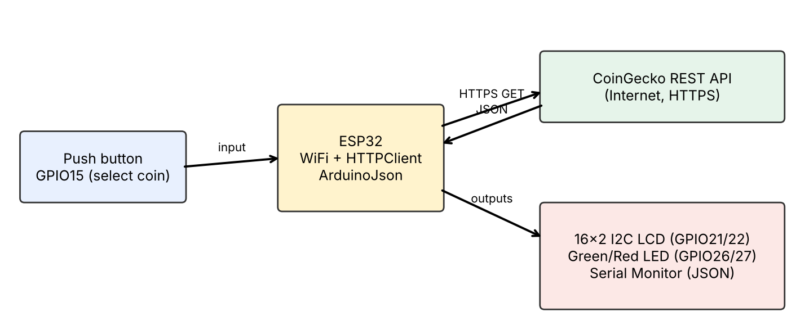
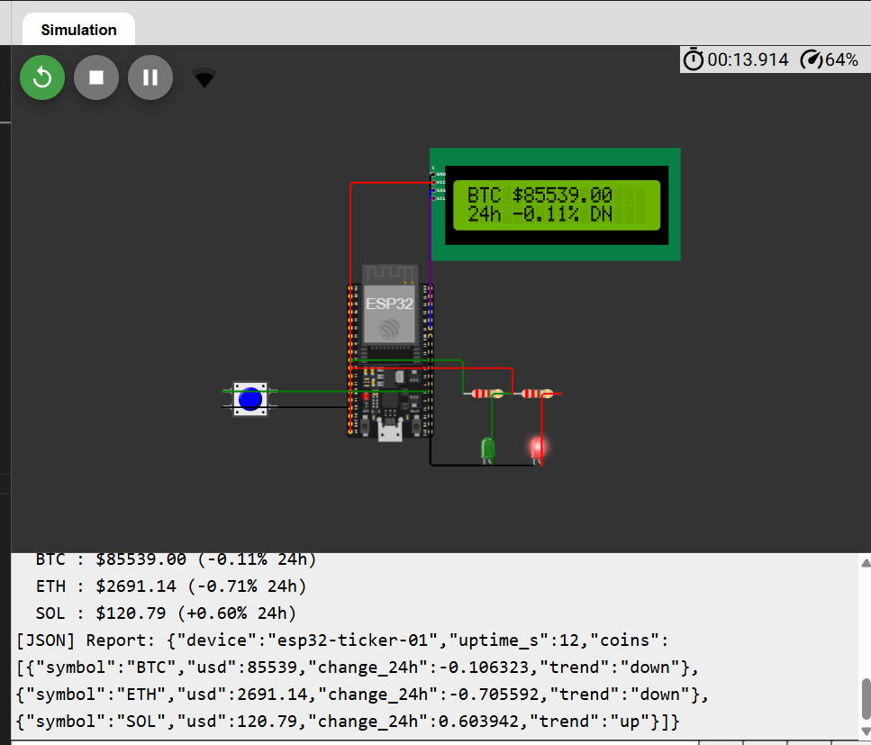

# ENGR4399-ESP32-WiFi-Assignment

**ENGR 4399 ST: Cyber-Physical & IoT Systems – Simulation Assignment 3 (ESP32 WiFi, APIs, and Cloud Data)**
Author: Luis de Oliveira · Fall 2026

## Project Overview
An **ESP32 Cryptocurrency Price Ticker** simulated in [Wokwi](https://wokwi.com/). The ESP32 joins the open `Wokwi-GUEST` WiFi network, calls the free **CoinGecko** REST API over HTTPS, parses the **JSON** response (BTC, ETH, SOL price in USD plus 24-hour change), and shows the selected coin on a 16x2 I2C LCD. A green LED means the 24 h trend is up, a red LED means down. A button cycles through the coins, and a JSON status report (the payload that would be pushed to a cloud service) is printed to the Serial Monitor.

## System Block Diagram


```
 [Push button GPIO15] ---> [ ESP32 ] --WiFi (Wokwi-GUEST)--> [Internet] --HTTPS GET--> [CoinGecko API]
                              |  ^                                                          |
                              |  +------------------- JSON response -----------------------+
                              +--I2C (21/22)--> [16x2 LCD]
                              +--> [Green LED GPIO26] / [Red LED GPIO27]
                              +--> [Serial Monitor: parsed prices + JSON report]
```

## WiFi and API Interaction
1. `WiFi.begin("Wokwi-GUEST", "", 6)` connects with no password.
2. `HTTPClient` + `WiFiClientSecure` sends an HTTPS GET to
   `https://api.coingecko.com/api/v3/simple/price?ids=bitcoin,ethereum,solana&vs_currencies=usd&include_24hr_change=true`
3. The JSON reply (`{"bitcoin":{"usd":...,"usd_24h_change":...},...}`) is parsed with **ArduinoJson**.
4. A new JSON document (device, uptime, coins[symbol, usd, change_24h, trend]) is built with `serializeJson()`.
5. LCD, LEDs and Serial reflect the result. Auto-refresh every 60 s (API rate limit); the button only changes the displayed coin.

`setInsecure()` skips certificate validation – acceptable for simulation only; production devices should validate the CA certificate.

## Pin Map
| GPIO | Component | Function |
|---|---|---|
| 15 | Push button (INPUT_PULLUP) | Select next coin |
| 21 / 22 | 16x2 LCD (I2C, 0x27) | SDA / SCL display |
| 26 | Green LED + 220 Ω | 24 h trend up |
| 27 | Red LED + 220 Ω | 24 h trend down |

## Run It
Open the Wokwi project: **https://wokwi.com/projects/477159033618258945**, press Play, open the Serial Monitor, and press the button to cycle coins.

## Screenshot
  *(add your screenshot as `screenshot.png`)*

## Files
`ENGR4399-ESP32-WiFi-Assignment.ino`, `diagram.json`, `libraries.txt`, `block_diagram.png`, `README.md`
